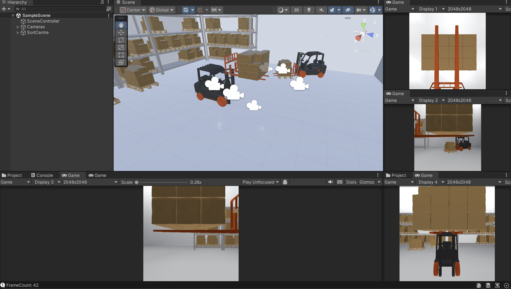

# UnityGenerData

Генерация синтетического датасета паллетов для модели компьютерного зрения на основе следующих ресурсов: [video tutorial](https://www.youtube.com/watch?v=P4CCMvtUohA) и [github](https://github.com/stratospark/UnityImageSynthesisTutorial1/tree/master?tab=readme-ov-file).

### Начало работы
1. Клонировать репозиторий.
2. Открыть при помощи Unity (использовалась версия 2022.3.44).
3. Открыть SampleScene в папке Assets/Scenes.
5. Перейти в SceneController объект. Выставить необходимых изображений в переменную Training Images, автивировать Save check-box, если необходимо. Прописать путь сохранения, предварительно создав нужную директорию.
6. Выбрать тип генерируемых паллетов:

    a. Если необходимо целый со всеми деталями, то включить Generate All Objects check-box, иначе - прописать необходимый процент наличия его составляющих в переменной Prcnt Of Num Gen Obj (ex. Prcnt Of Num Gen Obj = 0.8, значит, что в палете будет присутствовать от 80% до 100% не включительно деталей, таких как доски и бруски).

    b. Если необходимо, чтоб у сгенерированного палета не было сдвигов досок, то активировать Random Rotation, в противном случае в переменную Prcnt Of Rotation занести долю досок, которой необходимо задать вращение (ex. Prcnt Of Rotation = 0.1 значит, что будет вращаться 10% от общего числа составляющих паллета). Если Random Rotation, то подобрать нужную силу вращения в перменной Rotation Range изменяя параметры Y и Z.

    c. Если необходимо добавить торчащие гвозди, заполнить перменные, в которые входи подстрока Nails аналогично пунктам a и b.
   
